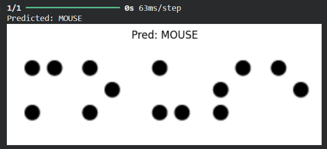
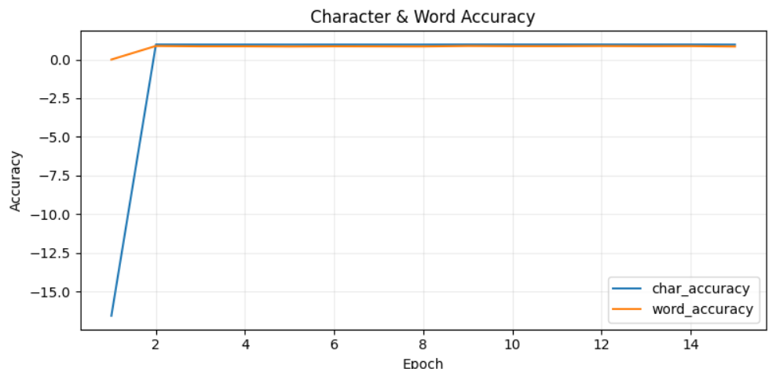
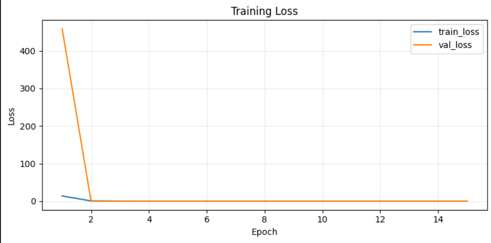

# 🧑‍🦯 Braille Word Recognition using CRNN + CTC

This project implements an end-to-end Optical Character Recognition (OCR) system for Braille words using a Convolutional Recurrent Neural Network (CRNN) with Connectionist Temporal Classification (CTC) loss.

Since a Braille word dataset was not publicly available, a synthetic dataset was created by programmatically stitching Braille character images into full words.

---

# 🚀 Key Features

- Custom Synthetic Braille Word Dataset
- CNN + BiLSTM Architecture (CRNN)
- CTC Loss (No character-level alignment required)
- Beam Search Decoding
- Character Error Rate (CER)
- Word Error Rate (WER)
- Confusion Matrix Analysis
- Word-level Accuracy Evaluation
- Inference-only Model Export

---

# 🧠 Model Architecture

- Input: 64 × 640 grayscale images
- CNN Backbone for feature extraction
- Bidirectional LSTM (2 layers)
- Dense Output Layer
- CTC Loss for sequence alignment

---

# 📊 Training Results

| Metric | Value |
|--------|--------|
| Epochs | 15 |
| Character Accuracy | ~0.94 |
| Word Accuracy | ~0.88 |
| Loss Converged | Yes |
| Decoding | Beam Search (width=12) |

---

# 📂 Dataset Creation

⚠️ A public Braille word dataset was NOT available.

Therefore:

1. A Braille character dataset was taken from Kaggle.
2. A Python script was used to stitch characters together into words.
3. Synthetic augmentation was applied (rotation, noise, blur, brightness).
4. Words were generated into class-wise folders.

---

## 🔗 Kaggle Character Dataset

https://www.kaggle.com/datasets/shanks0465/braille-character-dataset

All rights belong to the original dataset contributors.

---

# 🛠 Synthetic Dataset Generator

## Stitch Characters into Words

```python
rgba = stitch_char_images_for_word(
    word,
    char_map,
    target_height=120
)
```

---

## Apply Augmentations

```python
final = apply_global_augmentations(
    composed_image
)
```

---

## Generate Full Dataset

```python
synthesize_given_words(
    dataset_dir="Braille_characters",
    output_dir="Clean_braille_words",
    per_word_count=200,
    target_height=120,
    seed=42
)
```

Each word folder contains:

```
WORD/
├── WORD_00001.png
├── WORD_00002.png
├── ...
└── labels.csv
```

---

# 🏗 Model Definition (CRNN)

```python
infer_model, TIME_STEPS = build_crnn_model()

trainer = CRNNTrainer(infer_model)

trainer.compile(
    optimizer=tf.keras.optimizers.Adam(learning_rate=1e-4)
)
```

---

# 🔥 Training

```python
history = trainer.fit(
    train_gen,
    steps_per_epoch=steps_per_epoch,
    epochs=15,
    validation_data=val_gen,
    validation_steps=validation_steps
)
```

---

# 🤖 Inference

### Predict Single Image

```python
pred = predict_single_image(
    "sample.png",
    beam_width=8,
    show_image=True
)
```

---

### Predict Entire Folder

```python
predict_unseen_folder(
    unseen_dir="test_images",
    beam_width=12,
    save_overlay=True
)
```

---

# 📈 Evaluation Metrics

### Character Error Rate (CER)

```
CER = Levenshtein Distance / Length of Ground Truth
```

### Word Error Rate (WER)

```
WER = Edit Distance over word tokens
```

---

# 📊 Confusion Matrix

```python
evaluate_confusion_matrix(
    val_paths,
    val_labels,
    infer_model,
    num_to_char,
    char_to_num
)
```

---

# 📉 Training Curves

```python
plot_loss_and_accuracy_from_history(history)
```

---

# 📁 Project Structure

```
.
├── braille_ocr.ipynb
├── create words.py
├── checkpoints_ctc/
├── Clean_braille_words/
├── README.md
└── requirements.txt
```

---

# 🎯 What This Project Demonstrates

- Sequence modeling with CTC loss
- OCR system implementation
- Synthetic dataset engineering
- Beam search decoding
- Evaluation metrics (CER, WER)
- Model deployment-ready inference

---

## 📊 Results

### Sample Predictions
<p align="center">
  
</p>

### Accuracy Curve
<p align="center">
  
</p>

### Loss Curve
<p align="center">
  
</p>

---

## 👨‍💻 Author

Abhijith Babu
Passionate about ML & AI 🚀

📌 GitHub: [https://github.com/AbhijithBabu12]

📌 LinkedIn: [https://www.linkedin.com/in/abhijith-babu-856170201/]
